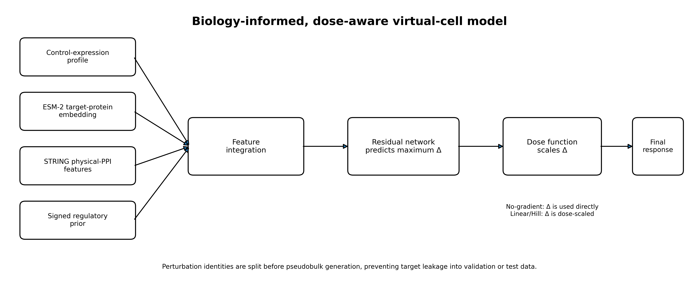
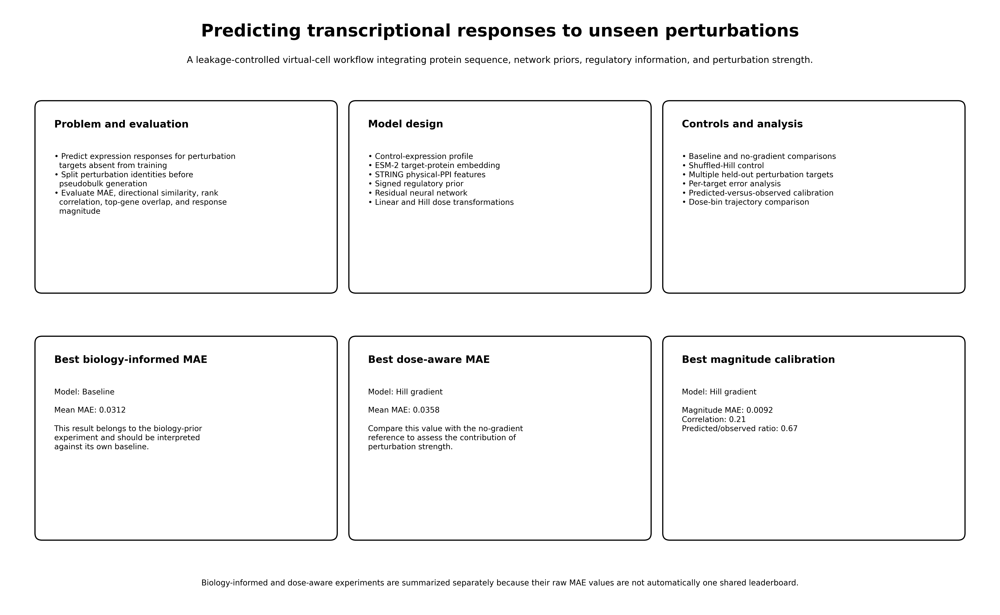
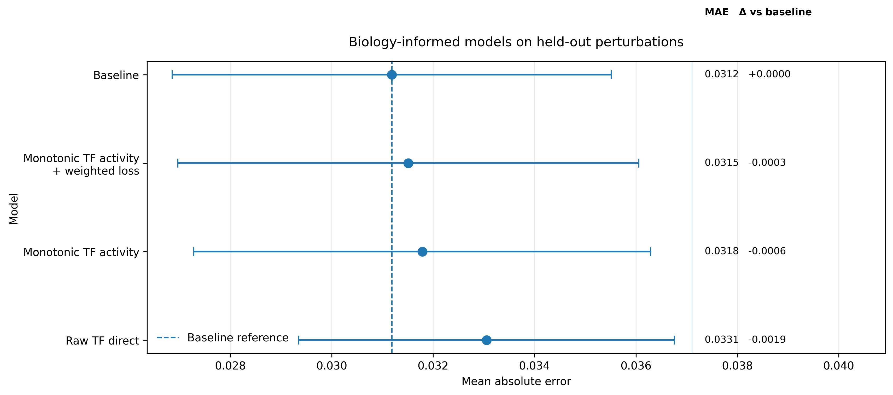
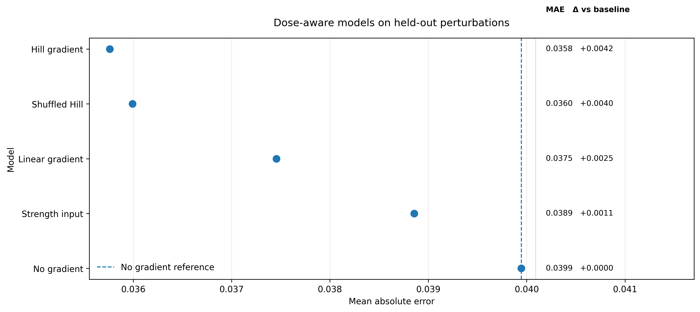
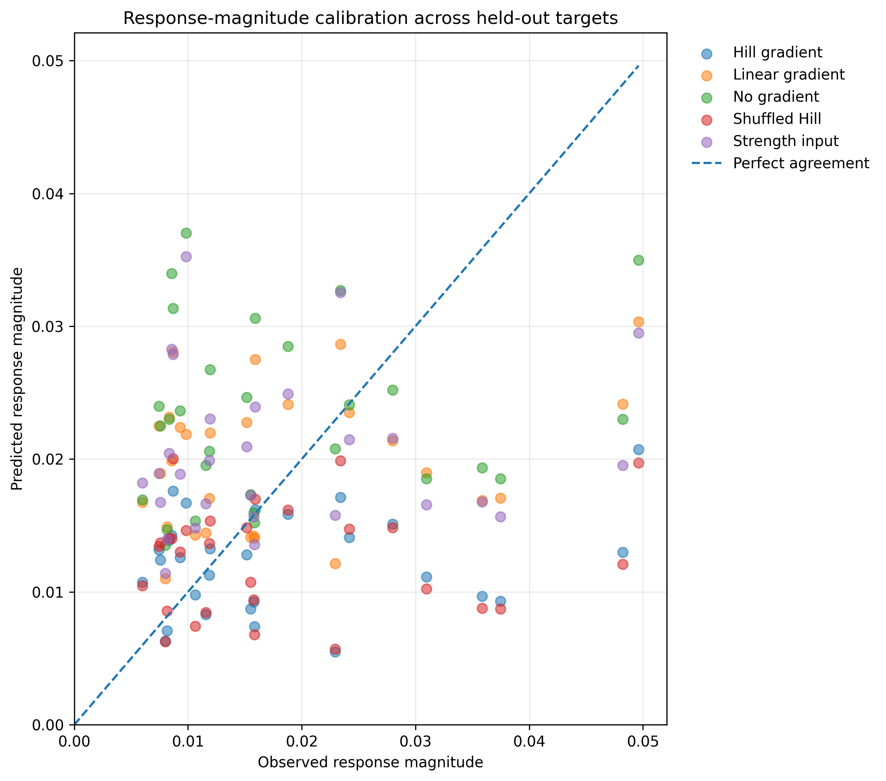
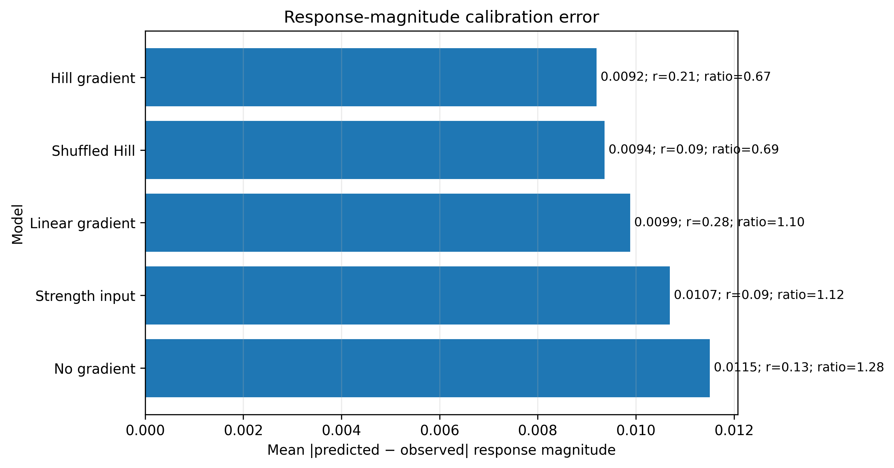
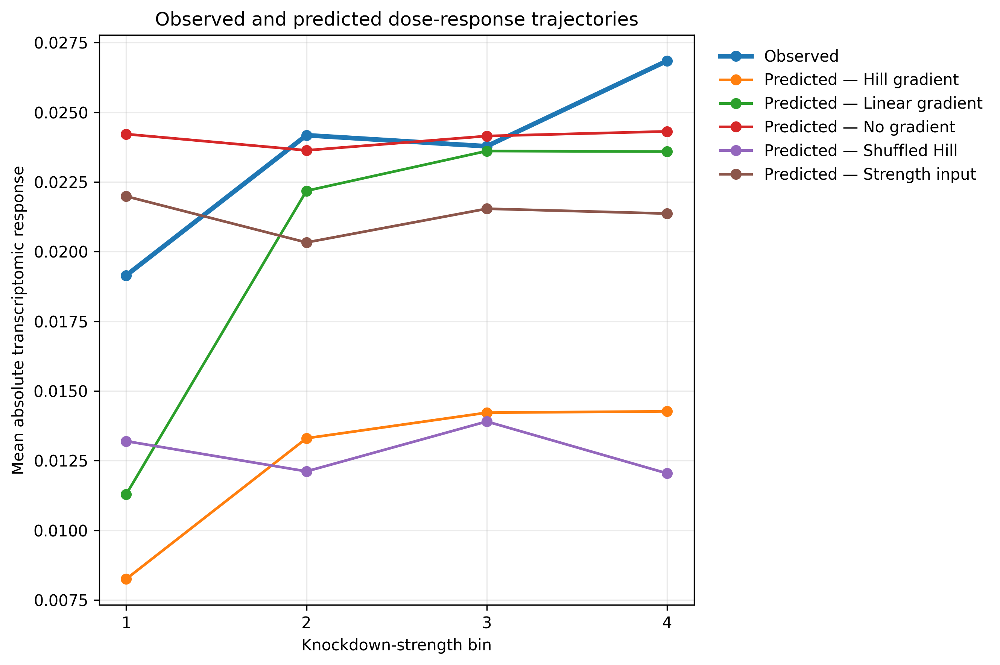
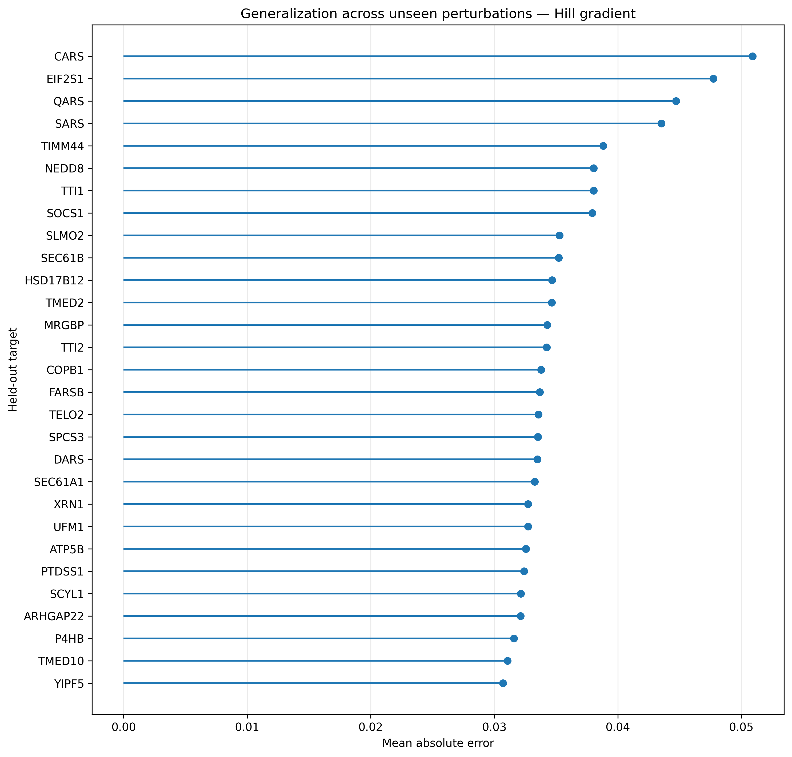

## Model overview

This workflow predicts transcriptional responses to perturbations that were excluded from model training. Perturbation identities are split before pseudobulk construction, preventing the same target from appearing in both training and evaluation data.

The model integrates control-expression profiles, ESM-2 target-protein embeddings, STRING physical protein–protein interaction features, signed regulatory priors, and perturbation-strength information. A residual neural network predicts the maximum perturbation response, which can then be scaled using linear or Hill dose-response functions.

## Project summary
This project evaluates two related questions:

1. Can biological priors improve prediction of unseen perturbations?
2. Can explicit perturbation-strength modeling improve response prediction?

The workflow includes baseline comparisons, shuffled controls, per-target evaluation, dose-bin analysis, and predicted-versus-observed response calibration.

## Biology-informed model comparison
The lowest mean MAE in this experiment was obtained by the baseline model, with a mean MAE of 0.0312.

The tested TF-activity formulations did not outperform the baseline on average, although the weighted monotonic TF model was the closest-performing biology-informed model.

This result indicates that adding biological priors does not automatically improve prediction of unseen perturbations. Possible explanations include incomplete regulatory-network coverage, insufficient cell-state specificity, inappropriate feature scaling, or mismatch between the prior network and the perturbation-response dataset.

The large variability across held-out perturbations also shows that performance depends strongly on target identity. Mean MAE should therefore be interpreted together with per-target results.

The lowest mean MAE in this experiment was obtained by
**Baseline**
(**0.0312**).

## Dose-aware model comparison
The Hill-gradient model achieved the lowest mean MAE in the dose-aware experiment.

* No-gradient reference: 0.0399
* Hill-gradient model: 0.0358
* Relative reduction in MAE: approximately 10.3%

This suggests that explicitly modeling perturbation strength can improve prediction.

However, the shuffled-Hill control achieved a very similar mean MAE of approximately 0.0360. Therefore, the improvement cannot yet be attributed confidently to biologically meaningful dose ordering alone.

The current result supports the usefulness of nonlinear response scaling, but additional controls and datasets are needed to determine whether the learned dose relationship is biologically specific.

The lowest mean MAE in this experiment was obtained by
**Hill gradient**
(**0.0358**).

## Predicted-versus-observed response magnitude
Each point represents one held-out perturbation target.

* The x-axis shows the observed transcriptomic response magnitude.
* The y-axis shows the predicted response magnitude.
* The diagonal line represents perfect agreement.

Points below the diagonal indicate underprediction, while points above the diagonal indicate overprediction.

Many Hill-gradient predictions fall below the diagonal, showing that the model tends to underestimate the magnitude of stronger perturbation responses. The model therefore captures some differences among perturbations but often predicts responses that are too small.
The Hill-gradient model showed the lowest response-magnitude calibration error among the tested dose-aware models.

Its predicted-to-observed magnitude ratio was approximately 0.67, indicating that its predicted response magnitude was, on average, about two-thirds of the observed magnitude.

The linear-gradient model had a predicted-to-observed ratio closer to 1.0, but its higher transcript-level MAE shows that matching the average response magnitude does not necessarily produce more accurate gene-level predictions.

These results distinguish two different aspects of performance:

* transcript-level MAE measures gene-expression prediction error;
* magnitude calibration measures whether the total response amplitude is predicted correctly.

Points close to the diagonal indicate that the model predicts the
overall transcriptomic response magnitude accurately. Points below the
diagonal indicate systematic underprediction.

## Dose-response trajectories
The observed transcriptomic response generally increases with stronger knockdown, although the relationship is not perfectly monotonic across all bins.

The Hill-gradient model follows the increasing trend but consistently underestimates the observed response magnitude.

The linear-gradient model more closely matches the observed response magnitude in several intermediate and strong knockdown bins, but it performs worse in overall transcript-level MAE.

The no-gradient model produces an almost flat trajectory across dose bins, demonstrating that a model without explicit perturbation-strength information cannot represent strength-dependent response changes.

Together, these results show that different evaluation metrics emphasize different model properties:

* transcript-level MAE evaluates gene-level prediction accuracy;
* response-magnitude calibration evaluates amplitude accuracy;
* dose trajectories evaluate whether the predicted response changes appropriately with perturbation strength.

## Generalization across held-out targets
Prediction difficulty varies substantially across unseen perturbation targets.

Relatively well-predicted targets include:

* YIPF5
* TMED10
* P4HB
* ARHGAP22

More difficult targets include:

* CARS
* EIF2S1
* QARS
* SARS

This heterogeneity suggests that model performance depends on target-specific biological properties, including pathway context, perturbation-response magnitude, regulatory complexity, protein-network connectivity, and the quality of available sequence and interaction features.

Reporting only the overall mean MAE would hide these important target-level differences.

> Biology-informed and dose-aware experiments are shown separately
> because raw MAE values should only be directly compared when the
> underlying test data and pseudobulk construction are identical.

## Main conclusions

* Perturbation-identity splitting provides a leakage-controlled evaluation of generalization to unseen perturbations.
* The tested TF-activity priors did not improve mean MAE over the baseline.
* Explicit perturbation-strength modeling reduced prediction error.
* The Hill-gradient model achieved the lowest mean MAE in the dose-aware experiment.
* The shuffled-Hill control performed similarly, so the biological specificity of the improvement remains uncertain.
* The models systematically underestimate transcriptomic response magnitude.
* Prediction performance varies substantially across perturbation targets.
* Future improvements should focus on response calibration, cell-state-specific biological priors, and target-specific error modeling.

Interpretation note: The biology-informed and dose-aware experiments are presented separately because their raw MAE values should only be compared directly when they use identical test data, feature sets, and pseudobulk construction.
